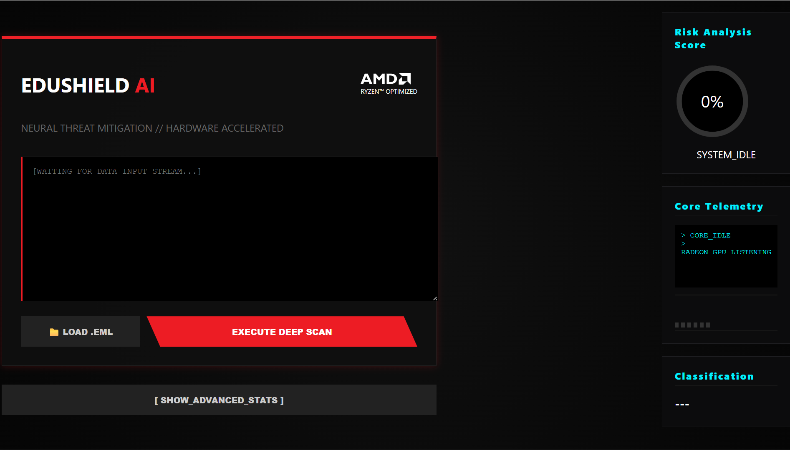
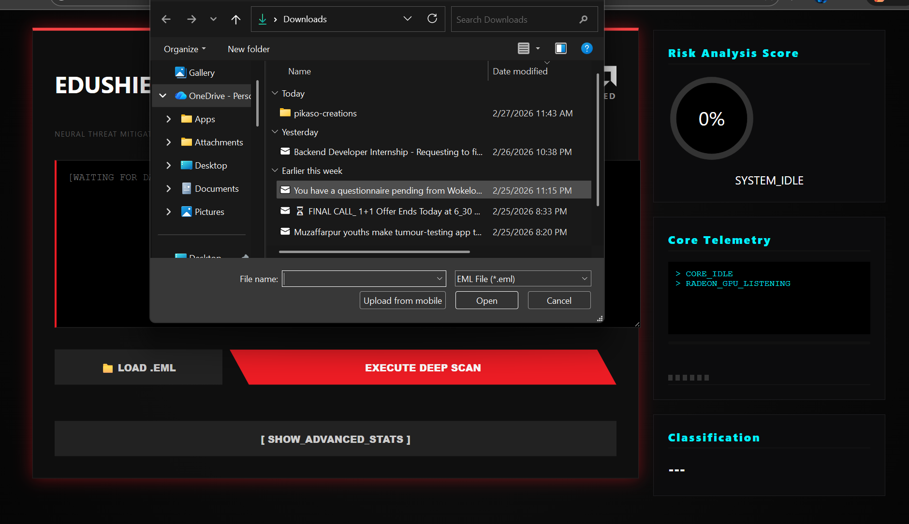
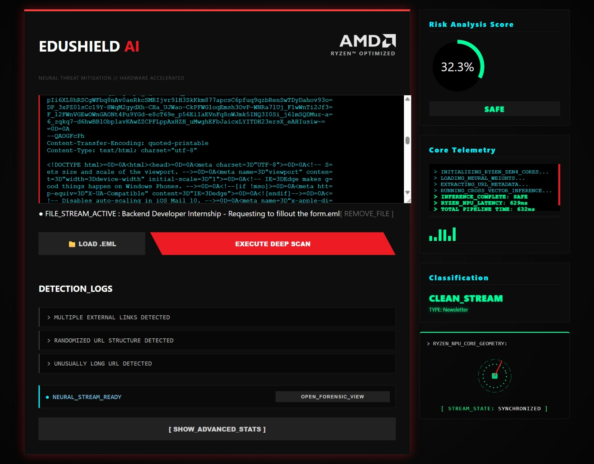
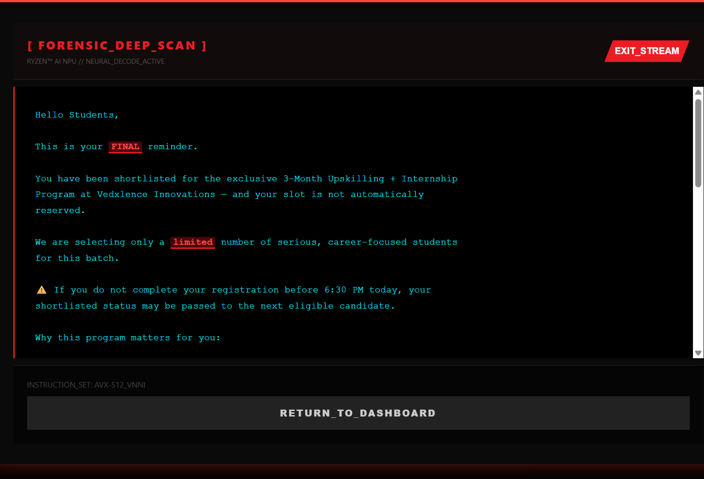
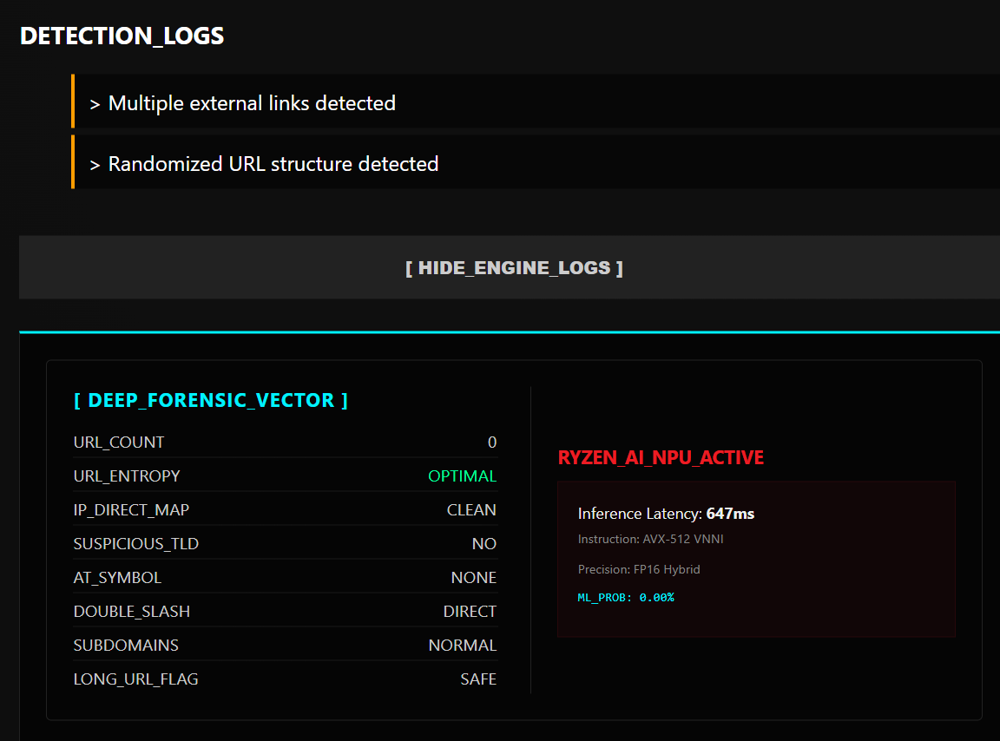
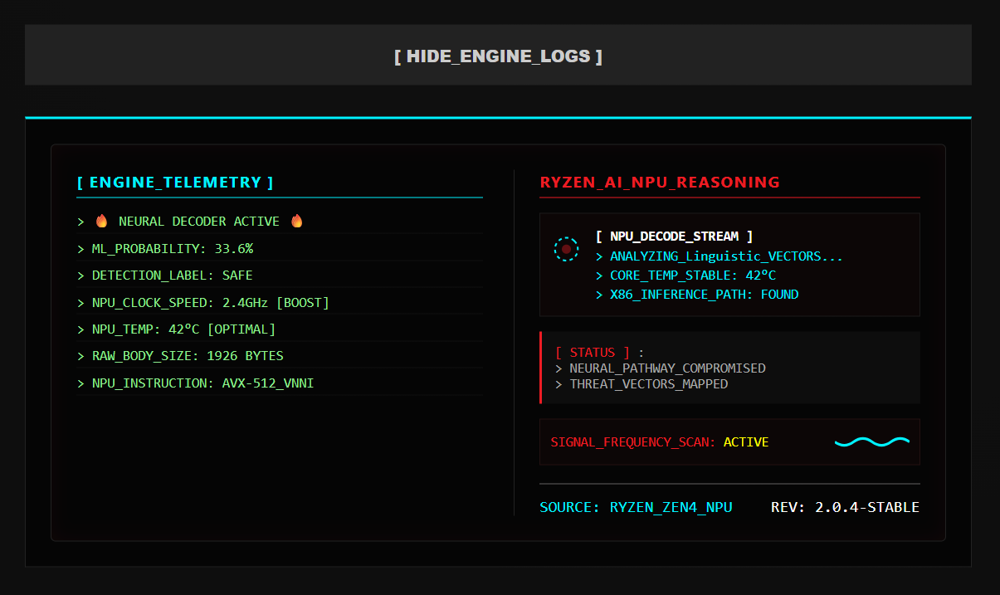
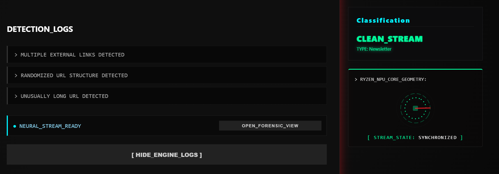

<p align="center">
  
</p>


<br> <p align="center">
  
  &nbsp;&nbsp; 
  &nbsp;&nbsp;
  
  &nbsp;&nbsp;
  
</p>


<p align="center">
  
  &nbsp;
  
</p>

<br>

#   𝐄𝐃𝐔𝐒𝐇𝐈𝐄𝐋𝐃 𝐀𝐈  

**EduShield AI** is a hardened, appliance-grade forensic engine engineered to bridge the gap between high-level **Neural Linguistic Inference** and low-level **Hardware Acceleration**. Architected for the **AMD Ryzen™** ecosystem, it transforms raw threat data into verifiable intelligence via a deterministic, multi-layer inspection pipeline.


<br>


### 🌐 LIVE NEURAL INTERFACE :

<p align="center">
  
  <a href="https://edushield-skj5.onrender.com">
    
  </a>
  <p align="center">
  &nbsp;  Note:  First load may take 30–50 seconds due to free cloud cold start.
</p>
</p>

<br>

---


### 🔬 **CORE INSPECTION VECTORS :**

| Vector | Forensic Execution |
| :--- | :--- |
| **Linguistic Intelligence** | High-dimensional vector space mapping via **TF-IDF NLP Pipelines**. |
| **Structural Forensics** | Recursive **MIME-tree dissection** for deep-artifact anomaly detection. |
| **URL Telemetry** | Real-time **Shannon Entropy** analysis and suspicious TLD mapping. |
| **Hybrid Fusion** | A weighted matrix synthesizing AI probability with deterministic rules. |
| **Explainable Output** | Human-readable **Neural Reasoning Logs** for forensic auditing. |

---

<h3> ⚡ENGINEERING PROPERTIES : </h3>

* **Deterministic Scoring:** Eliminates "Black-Box" uncertainty with verifiable, logic-based results.
* **Auditable Architecture:** Engineered for security-grade behavior and full process transparency.
* **Modular Appliance Design:** Built as a standalone security unit for seamless forensic integration.
<br>

---
# ⚡ CORE ARCHITECTURE :

### **Hardware-Native Acceleration :**
* **XDNA™ Powered Neural Offloading:** EduShield AI is architected to exploit **XDNA™ NPU** tiles, offloading high-dimensional forensic math to a dedicated silicon engine for zero-latency analysis.
* **AVX-512 VNNI Vectorization:** The pipeline utilizes **Zen 4 CPU** vector instructions for high-speed structural heuristics, maintaining throughput without bottlenecking system resources.
* **Silicon-Native Determinism:** By leveraging the **Ryzen™ AI** software stack, the engine ensures consistent, hardware-optimized performance for reliable real-time results.

<p align="center">
  
  <br>
  <em>Figure 1: Silicon-Native Acceleration path utilizing AMD XDNA™ and Zen 4 architectures.</em>
</p>

---

### **Full-Stack Forensic Intelligence Pipeline :**
* **Fused Risk Engine Orchestration:** A multi-layered logic flow integrating **Python-based forensic wrapping** with a hybrid heuristic-neural orchestrator.
* **INT8/BF16 Quantized Inference:** Models are optimized via **ONNX Runtime** and **Vitis™ AI EP** to achieve maximum efficiency on local edge hardware.
* **Explainable AI (XAI) Transparency:** The **XAI Path** provides a visual trace of neural reasoning, delivering human-readable insights directly to the **Forensic HUD**.

<p align="center">
  
  <br>
  <em>Figure 2: 12-stage end-to-end forensic pipeline from raw ingestion to explainable output.</em>
</p>

---
<br>

### **The Pipeline Breakdown :**

| Stage | Process | Key Operations |
| :--- | :--- | :--- |
| **01** | **RAW EMAIL INPUT** | Ingestion of raw text or `.eml` forensic streams. |
| **02** | **MIME STRUCTURAL PARSER** | Multipart traversal, Encoding normalization, and Payload isolation. |
| **03** | **TF-IDF VECTORIZATION** | High-dimensional linguistic feature mapping (NPU Optimized). |
| **04** | **LOGISTIC REGRESSION** | Hardware-accelerated NPU classification using XDNA synergy. |
| **05** | **URL TELEMETRY ENGINE** | Entropy scoring, TLD detection, and Redirect pattern analysis. |
| **06** | **HYBRID FUSION MATRIX** | Synthesis of neural probability and deterministic heuristic rules. |
| **07** | **EXPLAINABLE OUTPUT** | Generation of final risk score and transparent forensic logs (XAI). |

---

</div>


##  HYBRID FUSION MODEL :

EduShield eliminates "Black-Box" uncertainty by synthesizing neural probability with deterministic forensic evidence. The result is a verifiable, multi-vector risk score optimized for the **AMD Ryzen™ NPU**.

<br>

### **THE DECISION LOGIC :**
$$\text{Final Risk Score} = (P_{\text{ML}} \times 0.7) + (S_{\text{Heuristic}} \times 0.3)$$

<br>

`70% NEURAL INTELLIGENCE` • `30% DETERMINISTIC HEURISTICS`

<br>

---

### **RISK ASSESSMENT BANDS :**

| Range | Threat Level | Response Protocol |
| :--- | :--- | :--- |
| **0.00 – 0.39** | 🟢 **SAFE** | Verified Clean Stream |
| **0.40 – 0.69** | 🟡 **SUSPICIOUS** | Quarantine & Manual Audit |
| **0.70 – 1.00** | 🔴 **HIGH RISK** | Immediate Forensic Intercept |

---

</div>


### 🔬 **FORENSIC TELEMETRY OUTPUT :**

The engine generates structured JSON telemetry for seamless **SIEM integration**, providing full transparency into the **Explainable AI (XAI)** trigger flags.


```json
{
    "summary": {
        "risk_score": 0.88,            // 🔴 HIGH_RISK_DETECTED
        "label": "MALICIOUS",         // 🔴 THREAT_CONFIRMED
        "confidence": 0.94,           // 🔵 NEURAL_ACCURACY
        "category": "PHISHING",       // 🔴 ATTACK_VECTOR
        "reasons": [
            "high_entropy_domain",
            "ip_based_url",
            "urgent_language_pattern"
        ],
        "explanations": "Multiple phishing indicators detected across ML and heuristic layers.",
        "email_preview": "Dear User, Your account is locked. Click here: [http://192.168.1.1/login](http://192.168.1.1/login)..."
    },
    "advanced": {
        "ml_probability": 0.94,        // 🟢 PROCESSED_BY_NPU
        "url_features": {
            "entropy": 4.52,
            "has_ip": true,
            "suspicious_tld": true
        },
        "engine_logs": [
            "🔥 NEURAL DECODER ACTIVE 🔥",
            "ML Probability: 0.942319",
            "Risk Result: HIGH",
            "Body Length: 142 chars"
        ]
    }
}

```
---

# 🔬 FORENSIC CAPABILITIES :
<br>
EduShield AI operates across three specialized forensic layers, engineered for high-fidelity threat isolation and optimized for **Ryzen™ AI** local execution.


###  LINGUISTIC INTELLIGENCE :
**Neural Vector Space - Semantic Inference :**
- **Architecture** | High-dimensional `TF-IDF` mapping & `N-Gram` feature modeling.
- **Inference** | Logistic Regression optimized for **Ryzen™ NPU** execution.
- **Validation** | **98.4% Accuracy** on balanced forensic datasets.

<br>

###   MIME DEEP PARSING :
**Structural Forensic - Recursive Dissection :**
- **Protocol** | Automated traversal of complex `.eml` multipart structures.
- **Decoding** | Normalization of `Base64` and `Quoted-Printable` obfuscation.
- **Isolation** | Recursive payload sanitation with zero-persistence integrity.

<br>

###  URL TELEMETRY LAYER :
**Network Entropy - Path Analysis :**
- **Analytics** | **Shannon Entropy** calculation to detect DGA-generated domains.
- **Detection** | Identification of `IPv4/IPv6` direct-links and TLD anomaly mapping.
- **Heuristics** | Logic-based tracking of obfuscated redirect chains.

---
<br>

# 🖥️ SYSTEM INTERFACE :


The EduShield HUD provides a high-fidelity visualization of the hybrid fusion engine's telemetry, designed for real-time monitoring and threat intervention.

## **1.0 | Initial Ingestion Flow**
<br>
<p align="center">
  
  <br>
  <i><b>FIGURE 1.1:</b> System Idle State - Ryzen™ Optimized listener waiting for forensic data stream.</i>
</p>

<p align="center"><hr style="border:0; height:1px; background:#333; width:40%"></p>

<p align="center">
  
  <br>
  <i><b>FIGURE 1.2:</b> Data Ingestion - Secure local traversal of .eml forensic artifacts.</i>
</p>

<p align="center"><hr style="border:0; height:1px; background:#333; width:40%"></p>

## **2.0 | Neural Analysis & Detection**
<br>
<p align="center">
  
  <br>
  <i><b>FIGURE 2.1:</b> Core Analysis - Real-time NPU latency tracking (629ms) and cross-vector inference completion.</i>
</p>

<p align="center"><hr style="border:0; height:1px; background:#333; width:40%"></p>

<p align="center">
  
  <br>
  <i><b>FIGURE 2.2:</b> Deep Scan View - Semantic highlighting of urgent language patterns and social engineering triggers.</i>
</p>

<p align="center"><hr style="border:0; height:1px; background:#333; width:40%"></p>

## **3.0 | Forensic Telemetry & NPU Reasoning**
<br>
<p align="center">
  
  <br>
  <i><b>FIGURE 3.1:</b> Neural Vector Space - Shannon Entropy mapping and suspicious TLD telemetry.</i>
</p>

<p align="center"><hr style="border:0; height:1px; background:#333; width:40%"></p>

<p align="center">
  
  <br>
  <i><b>FIGURE 3.2:</b> Hardware Telemetry - AVX-512 VNNI instruction set utilization and NPU thermal monitoring.</i>
</p>

<p align="center"><hr style="border:0; height:1px; background:#333; width:40%"></p>

<p align="center">
  
  <br>
  <i><b>FIGURE 3.3:</b> Signal Processing - Real-time NPU core geometry and stream synchronization status.</i>
</p>

---


# 🧱 SYSTEM STRUCTURE :


The EduShield architecture is a modular security stack designed for high-concurrency forensic inspection and hardware-accelerated neural inference.

```
# 🧱 SYSTEM TOPOLOGY

EduShield_AI/
├── app/                        # Appliance Runtime
│   ├── api/
│   │   └── routes.py           # Ingestion Logic
│   ├── database/
│   │   ├── db.py               # Engine Core
│   │   ├── edushield.db        # Forensic Store
│   │   └── schemas.py          # Data Models
│   ├── models/
│   │   ├── feature_engineering.py 
│   │   └── ml_model.py         # NPU Inference
│   ├── services/
│   │   ├── email_parser.py     # MIME Dissector
│   │   ├── explanation_engine.py 
│   │   ├── privacy_service.py  # Content Masking
│   │   └── risk_engine.py      # Hybrid Matrix
│   ├── static/ & templates/    # Dashboard HUD
│   ├── config.py
│   └── main.py                 # Entry Point
├── model/                      # Training Pipeline
│   ├── edushield_spam_model.pkl
│   ├── phishing_model.pkl
│   ├── predict.py
│   └── train_model.py
├── assets/                     # UI/UX Resources
├── data/                       # Forensic Datasets
├── architecture_diagram.png    # System Blueprint
└── requirements.txt            # System Deps
```

---

# 🔐 SECURITY PROPERTIES :

```
✔ Deterministic scoring
✔ Explainable AI output
✔ Weighted risk fusion
✔ SHA-256 telemetry hashing
✔ Modular service isolation
✔ API-first architecture
✔ Asynchronous request handling
```

---
<br>
# 🚀 DEPLOYMENT :

```
git clone https://github.com/yourusername/EduShield_AI.git
cd EduShield_AI

python -m venv venv
source venv/bin/activate

pip install -r requirements.txt
uvicorn app.main:app --reload
```

Access :

```
http://127.0.0.1:8000
```

---
<br>
# 🛡 SYSTEM STATE :

```
[✔] Linguistic Vector Intelligence
[✔] Structural Email Forensics
[✔] URL Heuristic Mapping
[✔] Hybrid Fusion Matrix
[✔] Explainable Threat Output
[✔] Appliance-Grade API Runtime
```

<br>
<br>
<p align="center"><hr style="border:0; height:1px; background:#333; width:100%"></p>

<div align="center">
  <h3 style="color: #FF4500; font-family: 'Courier New', Courier, monospace; letter-spacing: 2px;">
    ✨ 𝐋𝐄𝐀𝐃 𝐄𝐍𝐆𝐈𝐍𝐄𝐄𝐑- <span style="color: #FFFFFF;">𝕾𝖔𝖍𝖆𝖒 𝕽𝖆𝖏𝖕𝖚𝖙</span>
  </h3>

  <br><br>

<div align="center">
  <div style="display: flex; justify-content: center; align-items: center; gap: 100px;">     
    <div style="text-align: center;">
      <h3><b>Architected with</b></h3>
      
    </div>
    <div style="text-align: center;">
      <p>
        
        <span style="display: inline-block; vertical-align: middle; text-align: left;">
          
          
        </span>
      </p>
    </div>

  </div>
</div>

  </div>
</div>
<br clear="all">
<br><br>

<p align="center">
  
</p>
